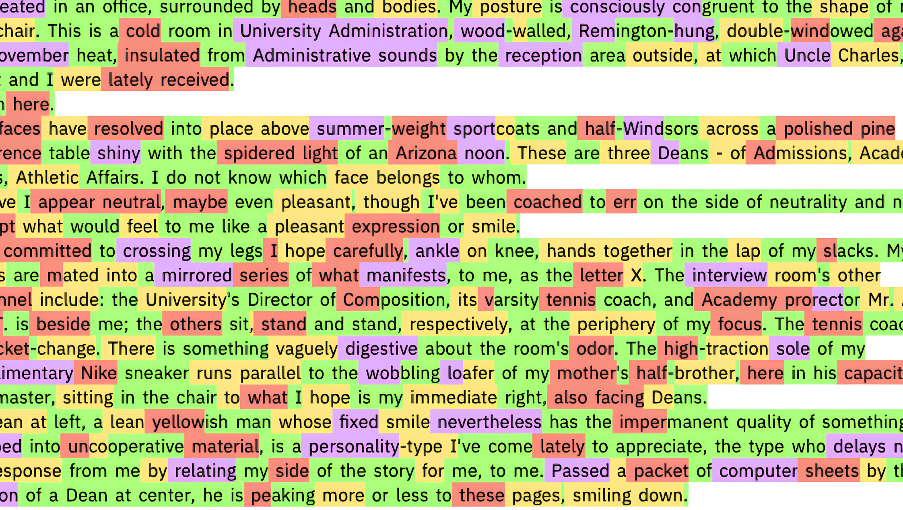
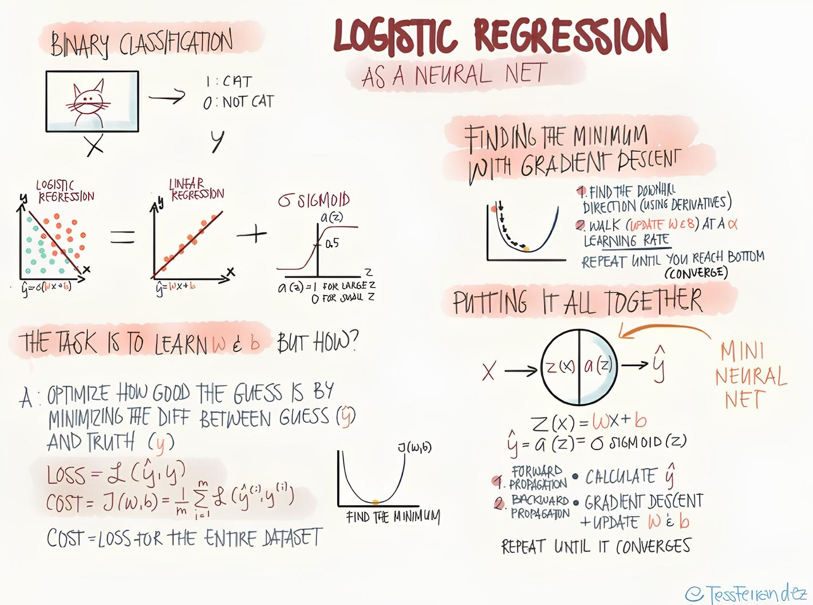

# detect-ai-written-text
Detect AI generated text, logistic regression neural network , written in raw python (just numpy).



## Logistic regression



## About the dataset
Around 60.000 essays are available in this dataset (in this repo), both created by AI and written by Human.

The Original dataset is here, it contains 500.000 essays.
https://www.kaggle.com/datasets/shanegerami/ai-vs-human-text/data

## Results
I used a total of 60,000 essays, with ~30,000 essays generated by AI and ~30,000 written by humans.
The data was split into two equal sets of 30,000 essays each (roughly 15,000 AI-generated and 15,000 human-written essays).
I trained the logistic regression model on one set of 15,000 AI-generated and 15,000 human-written essays and tested it on the other set of 15,000 AI-generated and 15,000 human-written essays.

Here are some results:

#### Parameters:
- epochs: 1 🥱
- learning_rate: 0.1

```shell
precision = 67.79%
recall = 94.71%
F1 = 79.02%
accuracy = 72.27%
```
--------------------------------
#### Parameters:
- epochs: 5
- learning_rate: 0.001

```shell
precision = 73.14%
recall = 90.89%
F1 = 81.05%
accuracy = 76.66%
```
--------------------------------
#### Parameters:
- epochs: 10 🤭
- learning_rate: 0.001

```shell
precision = 78.94%
recall = 87.84%
F1 = 83.15%
accuracy = 80.35%
```
--------------------------------
#### Parameters:
- epochs: 20
- learning_rate: 0.001

```shell
precision = 82.53%
recall = 86.53%
F1 = 84.48%
accuracy = 82.55%
```
--------------------------------
#### Parameters:
- epochs: 100 😇
- learning_rate: 0.001

```shell
precision = 90.13%
recall = 87.75%
F1 = 88.92%
accuracy = 87.96%
```

## How to use

### Train the model.
```python
import numpy as np
from logisticregression import LogisticRegression, read_labeled_data, create_vocabulary

# Create vocabulary.
V = create_vocabulary('AI_Human.csv')
# Read labeled data.
X, y = read_labeled_data('AI_Human.csv', V)

# Shuffle data. 
permu = np.random.permutation(len(X)) 
X, y = X[permu], y[permu]

# Split for training and testing data.
X_train, y_train = X[:30000], y[:30000]
X_test, y_test = X[30000:], y[30000:]

# Create LogisticRegression model.
lr = LogisticRegression(len(V))

# Train on training data. 
lr.train(X_train, y_train, True)

# Evaluate on testing data. 
precision, recall, f1, accuracy = lr.evaluate(X_test, y_test)
print(f"precision = {round(precision * 100, 2)}%")
print(f"recall = {round(recall * 100, 2)}%")
print(f"F1 = {round(f1 * 100, 2)}%")
print(f"accuracy = {round(accuracy * 100, 2)}%")
```

## Save weights and bias.
To save weights and bias just write:
```python
lr.save()
```
## Load weights and bias.
To load weights and bias just write:
```python
lr.load()
```

